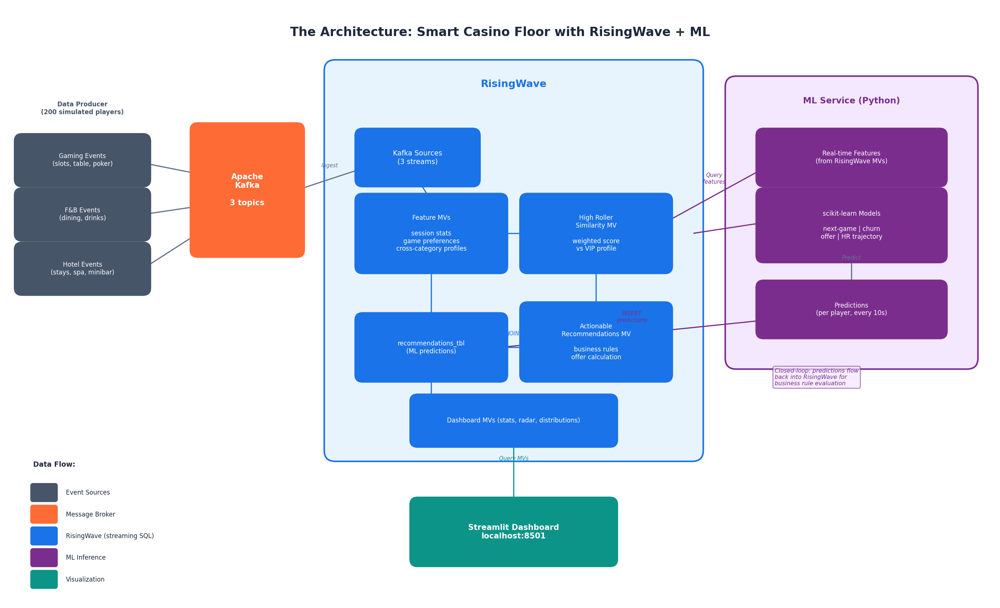

# Smart Casino Floor — Real-Time Gaming Analytics with RisingWave + ML

A reference demo showing **RisingWave** as a streaming feature store for personalized gaming recommendations, churn prediction, high-roller lookalike detection, and the industry-standard **Theoretical Win (Theo Win)** / **House Advantage** economics — all computed in real time over Kafka streams. Ships with a Streamlit dashboard and an embedded LLM chat agent.

## Architecture



**Data flow in one paragraph:** A producer emits gaming / F&B / hotel events into 3 Kafka topics. RisingWave ingests via Kafka sources and builds a stack of materialized views — 5-minute tumbling session features, running theo-win / house-edge aggregates, high-roller similarity scoring, and a unified `mv_player_features`. A Python ML service queries those MVs every 10s, runs four scikit-learn models, and writes predictions back into RisingWave via plain SQL INSERT. A final `mv_actionable_recommendations` MV layers business rules on top of the predictions, scaling offer values as a % of cumulative theo-win. The Streamlit dashboard queries the dashboard-facing MVs for live KPIs and charts, and its sidebar hosts a pluggable LLM chat agent that translates natural-language questions into SQL against the same MVs while persisting in-session chat memory to SQL.

## Recent Changes

- **Casino Floor Plan view:** new live 2D map of the physical gaming floor. Each of 32 tables has a fixed `(x, y)` position and a bet-limit range; gaming events are tagged with `table_id`, `limit_min`, and `limit_max`. A new MV `mv_table_recommendations` applies foot-traffic + bet-segmentation rules to flag each table as **RAISE_LIMIT** (packed, avg bet ≥ 70% of ceiling), **LOWER_LIMIT** (cold + min above entry-level), **HOT**, **COLD**, or **HOLD**, and suggests a new limit range. Rendered in the dashboard as a plotly scatter colored by action, plus a "Needs attention now" table of the tables to change.
- **Stateful chat memory:** the sidebar LLM agent now keeps conversation context across reruns and follow-up questions within the same chat session.
- **SQL-backed chat persistence:** chat history is stored in a `chat_messages` table. By default this uses RisingWave, but the storage layer is abstracted so it can be switched to Postgres later without changing the app call sites.
- **Clear-on-delete behavior:** pressing **Clear Chat** deletes the persisted rows for that chat session, resets Streamlit `session_state`, and starts a fresh session.
- **Unique VIP candidates:** `mv_high_roller_radar` now keeps only the latest row per `player_id`, so "top high-roller candidates" are unique players rather than duplicate window-level entries.
- **Safer LLM SQL generation:** generated SQL is normalized for RisingWave compatibility, including 2-argument `ROUND()` calls that require `NUMERIC`.

## Theoretical Win & House Advantage

These are the two most important metrics in casino marketing, now first-class features in the pipeline.

**House Advantage (house edge)** — the statistical percentage the casino wins from each bet, per game type:

| Game      | House Edge | Notes |
|-----------|-----------:|-------|
| Slots     |      7.50% | Highest edge, smallest average bet — casual volume leader |
| Baccarat  |      1.15% | **The Macau hero: ~88% of Macau GGR.** Tiny edge × enormous volume = biggest theo contributor |
| Roulette  |      5.26% | Minor on Asian floors |
| Blackjack |      0.75% | Secondary pit game |
| Poker     |      2.50% | Rake-equivalent vs. house; minor share |

**Theoretical Win** — the casino's *expected* profit from a player's wagering, independent of short-term luck:

```
theo_win = Σ ( bet_amount × house_edge_of_that_game )
```

Computed inline in `mv_player_session_features` per bet, then aggregated:
- `theo_win_window` — sum per 5-minute TUMBLE window (live KPI)
- `cumulative_theo_win` — running per-player lifetime total (in `mv_player_theo_cumulative`)
- `effective_house_edge` = `cumulative_theo_win / cumulative_wagered` — blended edge given the player's actual game mix (a blackjack-heavy whale has a lower effective edge than a slots-heavy grinder, even at the same wager volume)

**Why this matters:** reinvestment (comps, offers) in real casinos is set as a **percentage of cumulative theo**, not of wagered volume. `mv_actionable_recommendations` implements exactly this:

| action_type              | offer_value (reinvestment) |
|--------------------------|---------------------------:|
| `URGENT_RETENTION`       | 40% of cumulative theo     |
| `VIP_UPGRADE_CANDIDATE`  | 35% of cumulative theo     |
| `RETENTION_OFFER`        | 25% of cumulative theo     |
| `STANDARD_RECOMMENDATION`| 15% of cumulative theo     |

(With an `avg_bet` floor so brand-new players with no theo history still get a sensible offer.)

## Components

| Component | Description |
|-----------|-------------|
| **data_producer** | Generates realistic Macau-style event streams across 4 archetypes: `casual` (50%, mostly slots + light baccarat), `regular` (30%, baccarat-heavy), `high_roller` (12%, **baccarat VIP + blackjack** — the Asian core), `emerging` (8%, testing baccarat VIP). |
| **risingwave_sql** | 4 SQL files: Kafka sources, feature MVs (TUMBLE windows + theo-win), high-roller similarity scoring (now weighted 20% on cumulative theo), recommendation delivery with business rules, and a deduplicated `mv_high_roller_radar` for unique candidate ranking. |
| **ml_service** | Trains 4 scikit-learn models on synthetic data, then runs an inference loop querying RisingWave every 10s and writing predictions back via SQL INSERT. |
| **dashboard** | Streamlit app with live KPIs (incl. Theo Win window + Effective House Edge), High Roller Radar scatter plot, Theo-by-Tier chart, recommendation table, and a sidebar **LLM chat agent** with pluggable provider support plus persisted session memory. |

## ML Models

1. **Next-Best-Game** (Random Forest) — cross-sell game suggestion based on current play pattern
2. **Churn Probability** (Gradient Boosted Regressor) — likelihood the player leaves soon
3. **Offer Sensitivity** (Random Forest) — which reward converts best: free_play / fnb_voucher / hotel_upgrade / cashback
4. **High-Roller Trajectory** (Gradient Boosted Classifier) — is this player on track to become a VIP?

## Key Materialized Views

| MV | What it holds |
|---|---|
| `mv_player_session_features`    | Per-player 5-min TUMBLE gaming stats + `theo_win_window` |
| `mv_player_fnb_features`        | 5-min F&B spend per player |
| `mv_player_hotel_features`      | 5-min hotel activity per player |
| `mv_player_theo_cumulative`     | **Running per-player `cumulative_theo_win`, `cumulative_wagered`, `effective_house_edge`** |
| `mv_player_features`            | Unified feature store — one row per player per window |
| `mv_player_high_roller_similarity` | Weighted similarity score (0–1) incl. 20% weight on cumulative theo, with one row per player per window |
| `recommendations_tbl`           | Latest ML predictions (upserted every 10s by the inference service) |
| `mv_actionable_recommendations` | ML predictions + business rules + theo-based offer value |
| `mv_high_roller_radar`          | Non-VIP players with HR similarity > 0.4, keeping only the latest row per `player_id` for unique candidate ranking |
| `mv_theo_by_tier`               | Per-tier aggregation: total theo, avg theo, avg effective edge |
| `mv_dashboard_stats`            | Top-line rollup for dashboard KPIs |
| `tables_dim`                    | Static dimension table (36 physical tables, Macau-style — 16 slots, 8 baccarat standard + 2 VIP, 4 blackjack + 2 high-limit, 2 roulette, 2 poker) — `table_id`, `game_type`, `(x, y)`, `limit_min`, `limit_max` |
| `mv_table_activity`             | Per-table 5-min TUMBLE: active_players, bets, avg_bet, theo_win_window, max_bet |
| `mv_table_latest`               | Latest window per table (deduplicated "right now" view) |
| `mv_table_recommendations`      | Floor-plan view: LEFT JOIN of `tables_dim` with latest activity, plus a business-rule `action_type` (RAISE_LIMIT / LOWER_LIMIT / HOT / COLD / HOLD) and suggested new limit range |

## LLM Chat Agent

The dashboard sidebar hosts a natural-language agent that translates questions into SQL against the MVs above, runs them, and summarizes the results.

- **Pluggable providers:** Claude (Anthropic), OpenAI, OpenRouter, Azure OpenAI
- **Custom `base_url` support** for proxy/gateway routing (PackyAPI, OpenRouter, LiteLLM, etc.)
- Schema-aware system prompt — understands every MV column including `theo_win_window`, `cumulative_theo_win`, `effective_house_edge`
- **Conversation-aware follow-ups:** the agent receives recent chat history, prior SQL, and prior result rows so prompts like "these 5 players" resolve to the previous result set
- **Session persistence:** chat messages are persisted to SQL and restored on rerun/reload for the current chat session
- **Clear Chat semantics:** clearing the chat deletes that session's stored memory and creates a new session id
- **Storage abstraction:** default backend is RisingWave, with a drop-in path to Postgres later via `CHAT_STORE_*` configuration
- Read-only enforcement: only `SELECT` queries are executed
- RisingWave compatibility guardrails: generated SQL is normalized for functions like `ROUND(value, n)`

Sample questions:
- "Who are the top 5 players by cumulative theo win?"
- "What's the average effective house edge for diamond tier players?"
- "Which tier produces the most theo per player?"
- "How many VIP upgrade candidates are there and what's their average offer value?"
- "Who are the top 5 unique high-roller candidates?"
- "What are the Theo Wins for these 5 candidates?"

## Key RisingWave Features Demonstrated

- `TUMBLE()` windows for real-time feature engineering
- Streaming cumulative aggregates (no windows) for lifetime-value metrics
- Materialized views as a streaming feature store
- Multi-source JOINs for cross-category player profiles
- Inline house-edge lookup via `CASE` expressions in streaming aggregates
- Closed ML loop: predictions INSERTed back into RW, re-joined by another MV
- Business-rule layer (actionable recommendations) expressed purely in SQL

## Quick Start

```bash
cd smart-casino-floor

# Start everything
docker compose up --build

# Wait ~45s for services to initialize, then open:
#   Dashboard:  http://localhost:8501
#   RisingWave: psql -h localhost -p 4566 -U root -d dev
```

For the LLM chat agent, open the dashboard sidebar, pick a provider, paste an API key (optionally a custom `base_url` for proxies), and ask away.

### Chat Memory Storage

The dashboard now keeps LLM chat memory in two layers:

- `st.session_state` for immediate in-app responsiveness during the active Streamlit session
- SQL persistence in `chat_messages` for reload/rerun continuity within the same chat session

Default behavior:

- The chat store defaults to the same RisingWave instance used by the demo
- The current chat session id is tracked in the URL query param `chat_session`
- Clicking **Clear Chat** deletes persisted rows for that session and starts a new empty session

Future database switch:

- The storage layer is intentionally isolated in `dashboard/chat_store.py`
- The app can later point chat persistence at Postgres by wiring these environment variables into the dashboard container: `CHAT_STORE_BACKEND`, `CHAT_STORE_HOST`, `CHAT_STORE_PORT`, `CHAT_STORE_USER`, `CHAT_STORE_PASSWORD`, `CHAT_STORE_DBNAME`, `CHAT_STORE_SSLMODE`

## Explore the Data

```sql
-- Live per-window player features incl. theo win
SELECT player_id, tier, avg_bet,
       ROUND(theo_win_window::numeric, 2)        AS theo_win_window,
       ROUND(cumulative_theo_win::numeric, 2)    AS cumulative_theo,
       ROUND(effective_house_edge::numeric, 4)   AS effective_edge
FROM mv_player_features
ORDER BY theo_win_window DESC NULLS LAST
LIMIT 10;

-- House edge by tier (diamond/platinum typically lowest — they play blackjack/poker)
SELECT tier,
       ROUND(total_theo_win::numeric, 0)            AS total_theo,
       ROUND(avg_theo_per_player::numeric, 0)       AS avg_theo_per_player,
       ROUND(avg_effective_house_edge::numeric, 4)  AS avg_edge
FROM mv_theo_by_tier
ORDER BY total_theo DESC;

-- Emerging high rollers (non-VIP lookalikes, unique by player_id)
SELECT player_id, high_roller_similarity,
       avg_bet, spend_per_minute, cumulative_theo_win
FROM mv_high_roller_radar
ORDER BY high_roller_similarity DESC
LIMIT 10;

-- Actionable recommendations with theo-based offers
SELECT player_id, action_type, next_best_game,
       ROUND(churn_probability::numeric, 3) AS churn,
       ROUND(cumulative_theo_win::numeric, 0) AS theo,
       ROUND(offer_value::numeric, 0) AS offer
FROM mv_actionable_recommendations
WHERE action_type IN ('URGENT_RETENTION', 'VIP_UPGRADE_CANDIDATE')
ORDER BY offer_value DESC
LIMIT 20;
```

## Cleanup

```bash
docker compose down -v
```
