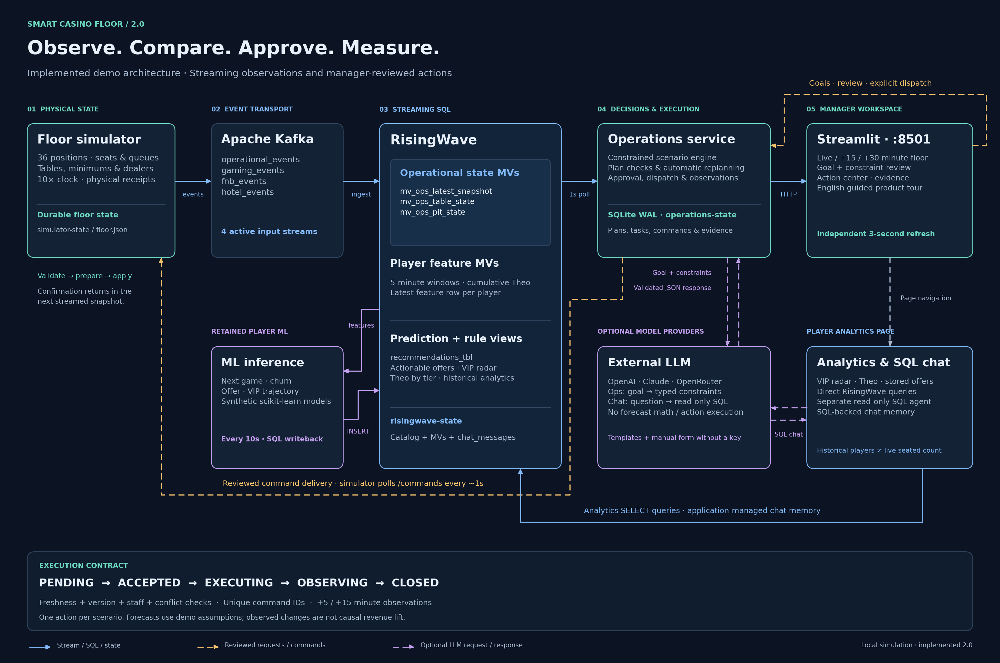

# Smart Casino Floor — Real-Time Gaming Analytics with RisingWave + ML

A reference demo showing **RisingWave** as a streaming feature store for personalized gaming recommendations, churn prediction, high-roller lookalike detection, and the industry-standard **Theoretical Win (Theo Win)** / **House Advantage** economics — all computed in real time over Kafka streams. Ships with a Streamlit dashboard and an embedded LLM chat agent.

## Architecture



**Data flow in one paragraph:** A producer emits gaming / F&B / hotel events into 3 Kafka topics. RisingWave ingests via Kafka sources and builds a stack of materialized views — 5-minute tumbling session features, running theo-win / house-edge aggregates, high-roller similarity scoring, the historical `mv_player_features`, and a one-row-per-player `mv_player_latest_features` snapshot. A Python ML service queries only that bounded snapshot every 10s, runs four scikit-learn models, and writes one prediction per player back into RisingWave via plain SQL INSERT. A final `mv_actionable_recommendations` MV layers business rules on top of the predictions, scaling offer values as a % of cumulative theo-win. The Streamlit dashboard queries the dashboard-facing MVs for live KPIs and charts, and its sidebar hosts a pluggable LLM chat agent that translates natural-language questions into SQL against the same MVs while persisting in-session chat memory to SQL.

## Recent Changes

- **Live Table Demand Balancer:** the 36-position floor now has 24 baccarat tables, 4 blackjack tables, and 8 standard slot machines; the former penny-slot area is an 8-table entry baccarat pit. One-minute occupancy can trigger **RAISE_MINIMUM** or **LOWER_MINIMUM** only for baccarat and blackjack. Slots remain visible as **MONITOR_ONLY** and never receive minimum-limit recommendations. Only the starting minimum changes; the maximum stays fixed.
- **Macau-style live floor labels:** baccarat squares and blackjack circles show current `HK$` starting minimum and occupied seats/capacity directly on each marker; displayed seats are capped at physical capacity, while full IDs and distinct one-minute visitors remain available on hover. Slot machines use stars and show occupancy only. The left and VIP baccarat pits share aligned rows, while Blackjack sits below the main pit so the map remains readable on narrow screens.
- **Stateful chat memory:** the sidebar LLM agent now keeps conversation context across reruns and follow-up questions within the same chat session.
- **SQL-backed chat persistence:** chat history is stored in a `chat_messages` table. By default this uses RisingWave, but the storage layer is abstracted so it can be switched to Postgres later without changing the app call sites.
- **Clear-on-delete behavior:** pressing **Clear Chat** deletes the persisted rows for that chat session, resets Streamlit `session_state`, and starts a fresh session.
- **Unique VIP candidates:** `mv_high_roller_radar` now keeps only the latest row per `player_id`, so "top high-roller candidates" are unique players rather than duplicate window-level entries.
- **Bounded real-time inference:** `mv_player_latest_features` provides exactly one latest row per player. ML inference and recommendation joins use this snapshot, preventing historical-window fan-out and guaranteeing one current recommendation per player.
- **Resilient database restarts:** long-running containers restart automatically and wait for RisingWave health. If chat persistence is temporarily unavailable, the UI keeps the active conversation in `session_state`, retries SQL persistence automatically, and queues Clear Chat deletion until the store recovers.
- **Durable RisingWave state:** the Compose volume is mounted at `/root/.risingwave`, preserving the catalog, materialized state, recommendations, and chat messages across container recreation.
- **Safer LLM SQL generation:** generated SQL is normalized for RisingWave compatibility, including 2-argument `ROUND()` calls that require `NUMERIC`.

## Theoretical Win & House Advantage

These are the two most important metrics in casino marketing, now first-class features in the pipeline.

**House Advantage (house edge)** — the statistical percentage the casino wins from each bet, per game type:

| Game      | House Edge | Notes |
|-----------|-----------:|-------|
| Slots     |      7.50% | Highest edge, smallest average bet — casual volume leader |
| Baccarat  |      1.15% | **The Macau hero: ~88% of Macau GGR.** Tiny edge × enormous volume = biggest theo contributor |
| Blackjack |      0.75% | Secondary pit game |

**Theoretical Win** — the casino's *expected* profit from a player's wagering, independent of short-term luck:

```
theo_win = Σ ( bet_amount × house_edge_of_that_game )
```

Computed inline in `mv_player_session_features` per bet, then aggregated:
- `theo_win_window` — sum per 5-minute TUMBLE window (live KPI)
- `cumulative_theo_win` — running per-player lifetime total (in `mv_player_theo_cumulative`)
- `effective_house_edge` = `cumulative_theo_win / cumulative_wagered` — blended edge given the player's actual game mix (a blackjack-heavy whale has a lower effective edge than a slots-heavy grinder, even at the same wager volume)

**Why this matters:** reinvestment (comps, offers) in real casinos is set as a **percentage of cumulative theo**, not of wagered volume. `mv_actionable_recommendations` implements exactly this:

| action_type              | offer_value (reinvestment) |
|--------------------------|---------------------------:|
| `URGENT_RETENTION`       | 40% of cumulative theo     |
| `VIP_UPGRADE_CANDIDATE`  | 35% of cumulative theo     |
| `RETENTION_OFFER`        | 25% of cumulative theo     |
| `STANDARD_RECOMMENDATION`| 15% of cumulative theo     |

(With an `avg_bet` floor so brand-new players with no theo history still get a sensible offer.)

## Components

| Component | Description |
|-----------|-------------|
| **data_producer** | Generates realistic Macau-style event streams across 4 archetypes: `casual` (50%, mostly slots + light baccarat), `regular` (30%, baccarat-heavy), `high_roller` (12%, **baccarat VIP + blackjack** — the Asian core), `emerging` (8%, testing baccarat VIP). |
| **risingwave_sql** | 5 SQL files: Kafka sources, feature MVs (TUMBLE windows + theo-win), high-roller similarity scoring, recommendation delivery, and one-minute table-occupancy balancing with starting-minimum guidance. |
| **ml_service** | Trains 4 scikit-learn models on synthetic data, then runs an inference loop querying RisingWave every 10s and writing predictions back via SQL INSERT. |
| **dashboard** | Streamlit app with live KPIs, High Roller Radar, Theo-by-Tier, a physical floor map with real-time table-load balancing, and a sidebar **LLM chat agent** with pluggable provider support plus persisted session memory. |

## ML Models

1. **Next-Best-Game** (Random Forest) — cross-sell game suggestion based on current play pattern
2. **Churn Probability** (Gradient Boosted Regressor) — likelihood the player leaves soon
3. **Offer Sensitivity** (Random Forest) — which reward converts best: free_play / fnb_voucher / hotel_upgrade / cashback
4. **High-Roller Trajectory** (Gradient Boosted Classifier) — is this player on track to become a VIP?

## Key Materialized Views

| MV | What it holds |
|---|---|
| `mv_player_session_features`    | Per-player 5-min TUMBLE gaming stats + `theo_win_window` |
| `mv_player_fnb_features`        | 5-min F&B spend per player |
| `mv_player_hotel_features`      | 5-min hotel activity per player |
| `mv_player_theo_cumulative`     | **Running per-player `cumulative_theo_win`, `cumulative_wagered`, `effective_house_edge`** |
| `mv_player_features`            | Unified feature store — one row per player per window |
| `mv_player_latest_features`     | Current feature snapshot — exactly one latest row per player, used by inference and current-state dashboards |
| `mv_player_high_roller_similarity` | Weighted similarity score (0–1) incl. 20% weight on cumulative theo, with one row per player per window |
| `recommendations_tbl`           | Latest ML predictions (upserted every 10s by the inference service) |
| `mv_actionable_recommendations` | ML predictions + business rules + theo-based offer value |
| `mv_high_roller_radar`          | Non-VIP players with HR similarity > 0.4, keeping only the latest row per `player_id` for unique candidate ranking |
| `mv_theo_by_tier`               | Per-tier aggregation: total theo, avg theo, avg effective edge |
| `mv_dashboard_stats`            | Top-line rollup for dashboard KPIs |
| `tables_dim`                    | Static dimension for 36 physical tables, including pit group, seat capacity, current limits, and the permitted floor for the starting minimum |
| `mv_table_activity`             | Per-table 1-min TUMBLE: active customers, bets, average bet, total bet, and theo win |
| `mv_table_latest`               | Active tables in the latest floor-wide one-minute window; tables without current activity no longer retain stale counts |
| `mv_table_live_load`            | All 36 tables joined with the current floor window, including zero-activity tables and capacity-based occupancy |
| `mv_pit_live_load`              | Weighted occupancy plus hottest/coldest table occupancy for each comparable pit |
| `mv_table_recommendations`      | One row per position with occupancy and pit comparison; baccarat/blackjack may receive RAISE_MINIMUM / LOWER_MINIMUM, while slots are always MONITOR_ONLY |

## LLM Chat Agent

The dashboard sidebar hosts a natural-language agent that translates questions into SQL against the MVs above, runs them, and summarizes the results.

- **Pluggable providers:** Claude (Anthropic), OpenAI, OpenRouter, Azure OpenAI
- **Custom `base_url` support** for proxy/gateway routing (PackyAPI, OpenRouter, LiteLLM, etc.)
- Schema-aware system prompt — understands every MV column including `theo_win_window`, `cumulative_theo_win`, `effective_house_edge`
- **Conversation-aware follow-ups:** the agent receives recent chat history, prior SQL, and prior result rows so prompts like "these 5 players" resolve to the previous result set
- **Session persistence:** chat messages are persisted to SQL and restored on rerun/reload for the current chat session
- **Graceful fallback:** a temporary SQL outage never blocks the dashboard; active messages remain in `session_state` and are synchronized after an automatic retry
- **Clear Chat semantics:** clearing the chat deletes that session's stored memory and creates a new session id
- **Storage abstraction:** default backend is RisingWave, with a drop-in path to Postgres later via `CHAT_STORE_*` configuration
- Read-only enforcement: only `SELECT` queries are executed
- RisingWave compatibility guardrails: generated SQL is normalized for functions like `ROUND(value, n)`

Sample questions:
- "Who are the top 5 players by cumulative theo win?"
- "What's the average effective house edge for diamond tier players?"
- "Which tier produces the most theo per player?"
- "How many VIP upgrade candidates are there and what's their average offer value?"
- "Who are the top 5 unique high-roller candidates?"
- "What are the Theo Wins for these 5 candidates?"

## Key RisingWave Features Demonstrated

- `TUMBLE()` windows for real-time feature engineering
- Streaming cumulative aggregates (no windows) for lifetime-value metrics
- Materialized views as a streaming feature store
- Multi-source JOINs for cross-category player profiles, with a bounded latest-row snapshot for online inference
- Inline house-edge lookup via `CASE` expressions in streaming aggregates
- Closed ML loop: predictions INSERTed back into RW, re-joined by another MV
- Business-rule layer (actionable recommendations) expressed purely in SQL
- One-minute floor-wide occupancy clock that correctly resets inactive tables to zero
- Within-pit demand balancing through capacity-aware baccarat/blackjack starting-minimum recommendations; slots are load-monitoring only

## Quick Start

```bash
cd smart-casino-floor

# Start everything
docker compose up --build

# Wait ~45s for services to initialize, then open:
#   Dashboard:  http://localhost:8501
#   RisingWave: psql -h localhost -p 4566 -U root -d dev
```

For the LLM chat agent, open the dashboard sidebar, pick a provider, paste an API key (optionally a custom `base_url` for proxies), and ask away.

### Chat Memory Storage

The dashboard now keeps LLM chat memory in two layers:

- `st.session_state` for immediate in-app responsiveness during the active Streamlit session
- SQL persistence in `chat_messages` for reload/rerun continuity within the same chat session

Default behavior:

- The chat store defaults to the same RisingWave instance used by the demo
- The current chat session id is tracked in the URL query param `chat_session`
- Clicking **Clear Chat** deletes persisted rows for that session and starts a new empty session

Future database switch:

- The storage layer is intentionally isolated in `dashboard/chat_store.py`
- The app can later point chat persistence at Postgres by wiring these environment variables into the dashboard container: `CHAT_STORE_BACKEND`, `CHAT_STORE_HOST`, `CHAT_STORE_PORT`, `CHAT_STORE_USER`, `CHAT_STORE_PASSWORD`, `CHAT_STORE_DBNAME`, `CHAT_STORE_SSLMODE`

## Explore the Data

```sql
-- Live per-window player features incl. theo win
SELECT player_id, tier, avg_bet,
       ROUND(theo_win_window::numeric, 2)        AS theo_win_window,
       ROUND(cumulative_theo_win::numeric, 2)    AS cumulative_theo,
       ROUND(effective_house_edge::numeric, 4)   AS effective_edge
FROM mv_player_features
ORDER BY theo_win_window DESC NULLS LAST
LIMIT 10;

-- House edge by tier (diamond/platinum typically lowest — they play blackjack/poker)
SELECT tier,
       ROUND(total_theo_win::numeric, 0)            AS total_theo,
       ROUND(avg_theo_per_player::numeric, 0)       AS avg_theo_per_player,
       ROUND(avg_effective_house_edge::numeric, 4)  AS avg_edge
FROM mv_theo_by_tier
ORDER BY total_theo DESC;

-- Emerging high rollers (non-VIP lookalikes, unique by player_id)
SELECT player_id, high_roller_similarity,
       avg_bet, spend_per_minute, cumulative_theo_win
FROM mv_high_roller_radar
ORDER BY high_roller_similarity DESC
LIMIT 10;

-- Actionable recommendations with theo-based offers
SELECT player_id, action_type, next_best_game,
       ROUND(churn_probability::numeric, 3) AS churn,
       ROUND(cumulative_theo_win::numeric, 0) AS theo,
       ROUND(offer_value::numeric, 0) AS offer
FROM mv_actionable_recommendations
WHERE action_type IN ('URGENT_RETENTION', 'VIP_UPGRADE_CANDIDATE')
ORDER BY offer_value DESC
LIMIT 20;
```

## Cleanup

```bash
docker compose down -v
```
